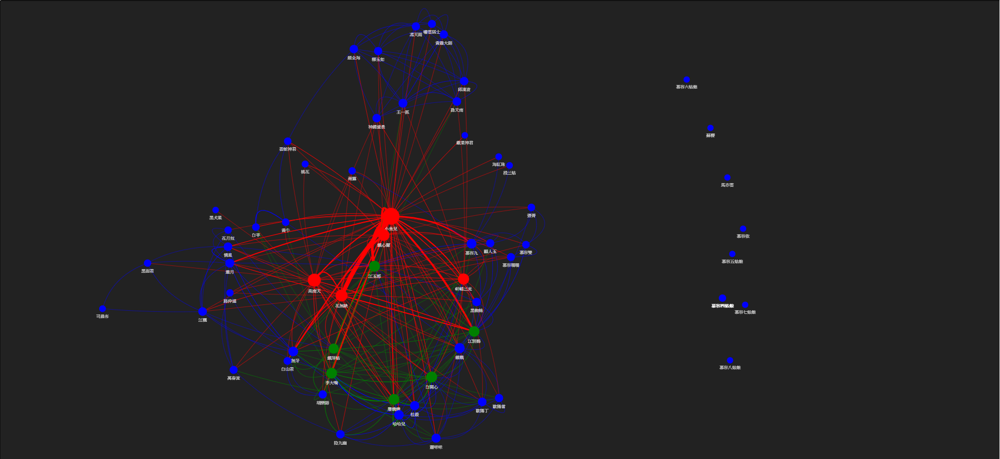
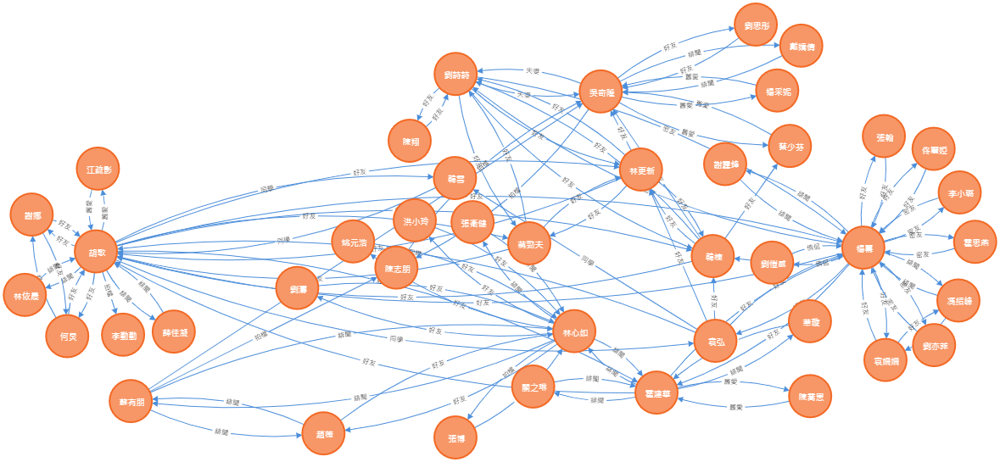
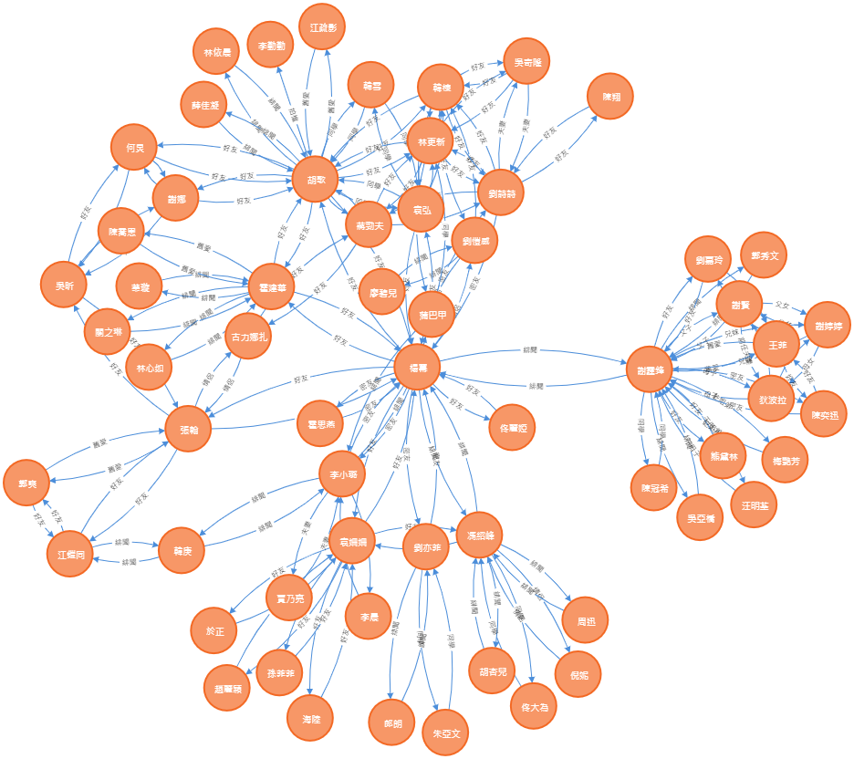
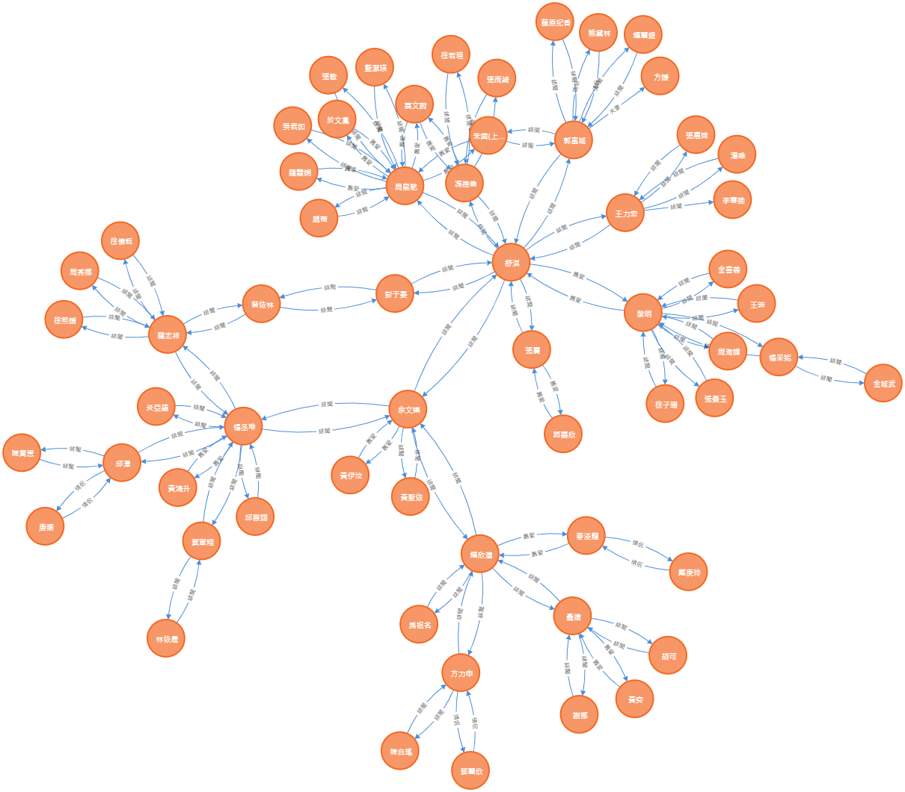
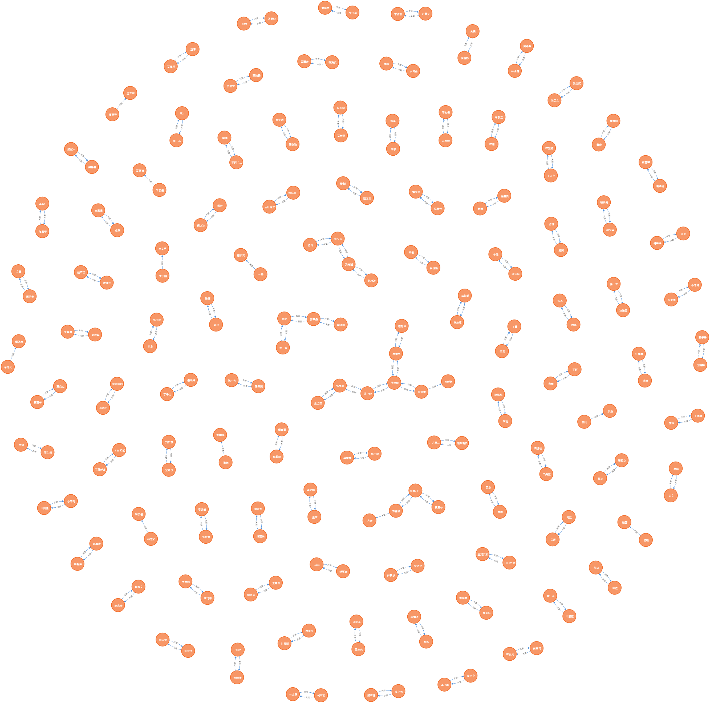

# American Technology Company Founders Social Network
### In this blog, we will use [DBpedia](https://wiki.dbpedia.org/) and [SparQL](https://jena.apache.org/tutorials/sparql.html) to build a social network.

## Preface

During my master's period, there were two projects. The first is to analyze the relationship network diagram of the characters in the novel, and the second is to use neo4j to draw the network of Chinese stars. Recently, I need to apply DBpedia, SparQL and social network technology in my work, so I made a prototype of the founder’s social network by the way.

1. relationship network diagram of the characters in the novel.

2. relationship network diagram of the star.


3. relationship network diagram of Mini Yang 2-degrees of separation.


4. sex-relationship network diagram of Shu Fanny 4-degrees of separation.

5. relationship network diagram of the star couple.


## What is Social Network?
A social network is a social structure made up of a set of social actors (such as individuals or organizations), sets of dyadic ties, and other social interactions between actors. The social network perspective provides a set of methods for analyzing the structure of whole social entities as well as a variety of theories explaining the patterns observed in these structures. The study of these structures uses social network analysis to identify local and global patterns, locate influential entities, and examine network dynamics.


## What is DBpedia?

### DBpedia is a crowd-sourced community effort to extract structured content from the information created in various Wikimedia projects. This structured information resembles an open knowledge graph (OKG) which is available for everyone on the Web. A knowledge graph is a special kind of database which stores knowledge in a machine-readable form and provides a means for information to be collected, organised, shared, searched and utilised. Google uses a similar approach to create those knowledge cards during search. We hope that this work will make it easier for the huge amount of information in Wikimedia projects to be used in some new interesting ways. 
## What is SparQL?

### SPARQL is a query language and a protocol for accessing RDF designed by the W3C RDF Data Access Working Group. 

### As a query language, SPARQL is “data-oriented” in that it only queries the information held in the models; there is no inference in the query language itself.  Of course, the Jena model may be ‘smart’ in that it provides the impression that certain triples exist by creating them on-demand, including OWL reasoning.  SPARQL does not do anything other than take the description of what the application wants, in the form of a query, and returns that information, in the form of a set of bindings or an RDF graph.
## Get American Technology Company Founders
### We will use SparQL to access the DBpedia endpoint to find American technology company founders.

### Function:
```
def get_American_technology_company_founders():
    founders = list()
    sparql = SPARQLWrapper("http://dbpedia.org/sparql")
    sparql.setQuery("""
        PREFIX   dbr:  <http://dbpedia.org/resource/>
        PREFIX   dct:  <http://purl.org/dc/terms/>
        SELECT ?value
        WHERE
        { ?value  dct:subject  dbr:Category:American_technology_company_founders  }
        """)
    sparql.setReturnFormat(JSON)
    results = sparql.query().convert()
    for result in results["results"]["bindings"]:
        founders.append({'url': result['value']['value'], 'name': result['value']['value'].split('/')[-1]})
    return founders
```

### Output:
```
[
  {
    "url": "http://dbpedia.org/resource/John_Gilmore_(activist)",
    "name": "John_Gilmore_(activist)"
  },
  {
    "url": "http://dbpedia.org/resource/Ross_Perot",
    "name": "Ross_Perot"
  },
  {
    "url": "http://dbpedia.org/resource/Seymour_Cray",
    "name": "Seymour_Cray"
  },
  {
    "url": "http://dbpedia.org/resource/William_Seward_Burroughs_I",
    "name": "William_Seward_Burroughs_I"
  },
  {
    "url": "http://dbpedia.org/resource/Arnold_Orville_Beckman",
    "name": "Arnold_Orville_Beckman"
  },
```
### Next, we must crawling their subjects for the founders so that we can build a relationship network in the future.

### Function:
```
def get_American_technology_company_founders_subjects(founders):
    for founder in founders:
        try:
            sparql = SPARQLWrapper("http://dbpedia.org/sparql")
            sparql.setQuery("""
                PREFIX   dct:  <http://purl.org/dc/terms/>
                SELECT ?value
                WHERE
                { <Person>  dct:subject  ?value  }
                """.replace("Person", founder['url']))
            sparql.setReturnFormat(JSON)
            results = sparql.query().convert()
            subjects = list()
            for result in results["results"]["bindings"]:
                check_subjects_map(result['value']['value'], founder)
                subjects.append(result['value']['value'])
            founder['subjects'] = subjects
            founder['subjects_size'] = len(subjects)
        except:
            print("occur except", founder['url'])
            pass
    return founders
```

### Output:
```
[
  {
    "url": "http://dbpedia.org/resource/John_Smedley_(video_games)",
    "name": "John_Smedley_(video_games)",
    "subjects": [
      "http://dbpedia.org/resource/Category:People_from_San_Diego",
      "http://dbpedia.org/resource/Category:1968_births",
      "http://dbpedia.org/resource/Category:American_technology_company_founders",
      "http://dbpedia.org/resource/Category:Corporate_executives",
      "http://dbpedia.org/resource/Category:Japanese_company_founders",
      "http://dbpedia.org/resource/Category:Living_people",
      "http://dbpedia.org/resource/Category:San_Diego_State_University_alumni",
      "http://dbpedia.org/resource/Category:Sony_people",
      "http://dbpedia.org/resource/Category:Video_game_designers",
      "http://dbpedia.org/resource/Category:American_business_executives",
      "http://dbpedia.org/resource/Category:Japanese_business_executives"
    ],
    "subjects_size": 11
  },
  {
    "url": "http://dbpedia.org/resource/Chris_Dixon",
    "name": "Chris_Dixon",
    "subjects": [
      "http://dbpedia.org/resource/Category:American_computer_businesspeople",
      "http://dbpedia.org/resource/Category:American_investors",
      "http://dbpedia.org/resource/Category:American_technology_chief_executives",
      "http://dbpedia.org/resource/Category:American_technology_company_founders",
      "http://dbpedia.org/resource/Category:Businesspeople_in_software",
      "http://dbpedia.org/resource/Category:Columbia_University_School_of_General_Studies_alumni",
      "http://dbpedia.org/resource/Category:Harvard_Business_School_alumni",
      "http://dbpedia.org/resource/Category:Living_people",
      "http://dbpedia.org/resource/Category:Private_equity_and_venture_capital_investors"
    ],
    "subjects_size": 9
  },
]
```
### Finally, we must calculate the co-occurrence subject between the founders and build a social network through Vis.js

## What is Vis.js

A dynamic, browser based visualization library. The library is designed to be easy to use, to handle large amounts of dynamic data, and to enable manipulation of and interaction with the data. The library consists of the components DataSet, Timeline, Network, Graph2d and Graph3d.

## Result


## Methodology references: 

* [DBpedia.](https://wiki.dbpedia.org/)
* [SparQL.](https://jena.apache.org/tutorials/sparql.html)
* [American Technology Company Founders.](http://dbpedia.org/page/Category:American_technology_company_founders)
* [Examples of Ontology Model Usage in Engineering Fields.](https://www.intechopen.com/books/ontology-in-information-science/examples-of-ontology-model-usage-in-engineering-fields)

## Tool references: 

* Social Network Visualization. 
    * [Vis.js](https://visjs.github.io/vis-network/examples/)
    * [Network - groups](https://visjs.github.io/vis-network/docs/network/groups.html)
    * [Network - nodes](https://visjs.github.io/vis-network/docs/network/nodes.html)
    * [Network - edges](https://visjs.github.io/vis-network/docs/network/edges.html)

